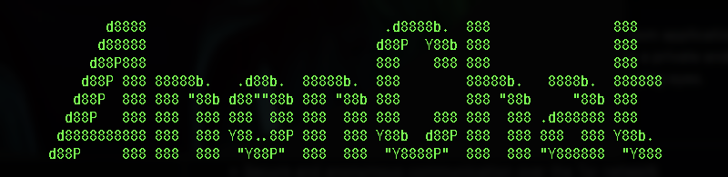
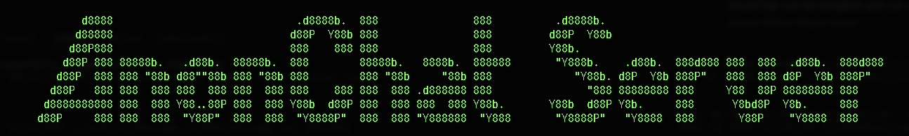

 

 

# AnonChat - Secure Terminal Chatroom Over Tor Onion Service

 

AnonChat is a secure, anonymous, and terminal-based chatroom application that operates over the Tor network. With AnonChat, you can communicate with others in a private and encrypted manner, ensuring that your conversations remain untraceable and protected from prying eyes.

## Key Features

- Secure and anonymous communication over the Tor network
- Terminal-based interface for a unique and intuitive experience
- Strong encryption to protect your conversations
- Easy to use and fast-loading interface

## Getting Started

AnonChat can be installed and run on most operating systems, including macOS, Linux and Windows. To get started with AnonChat, simply follow these steps:

1.  Install the Tor on your computer.
2.  Clone this repository to your local machine using the following command:

        git clone https://github.com/Baccount/Anon_Chat.git
        pip install -r requirements.txt

3.  Run the AnonChat Server using the following command:

        python server_start.py

4.  Run the AnonChat Client using the following command:

        python client_start.py

 

## Commands

### Server Commands

- `h` - Displays a list of commands
- `s` - "Send Message" - Sends a message to all connected clients
- `o` - "Show Onion Address" - Displays the Onion Address of the server
- `l` - "List" all users in the chat room and their IDs
- `ban` - "Ban" - Bans a user from the chat room. using the following command:

        ban <id>

### Client Commands

- `h` - Displays a list of commands
- `s` - "Send Message" - Sends a message to all connected clients except self
- `login` - "Login" - Logs into the chat room using the following command:

        login <username>

- `logout` - "Logout" - Logs out of the chat room
- `o` - "Show Onion Address" - Displays the Onion Address of the server
- `quit` - "Quit" - Quits the chat room

## Arguments

### Server Arguments

- `--test` or `-t` - Runs the server in test mode and skips asking user for bridges. Ephemeral onion service is created by default.

### Client Arguments

- `--test` or `-t` - Skips asking user for bridges
